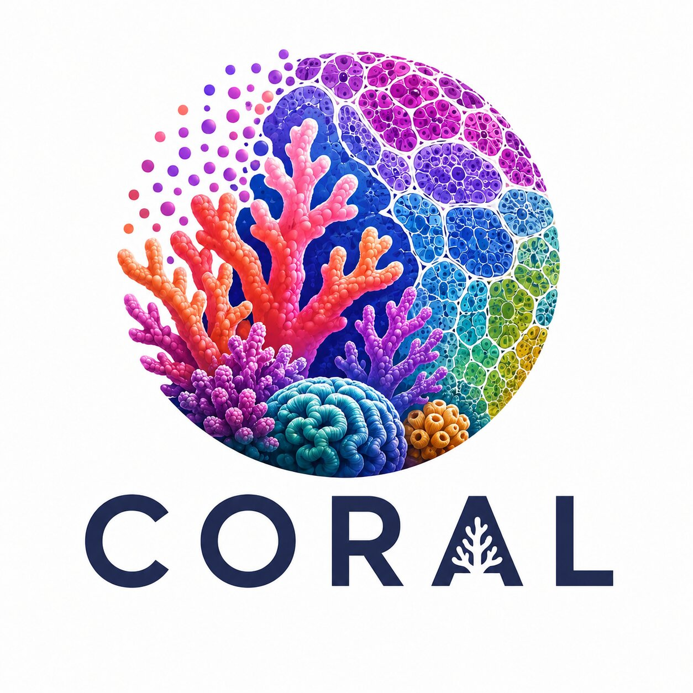

# CORAL

**A spatial biology toolkit that takes you from a raw tissue slide all the way to biology**

[KRONOS2](https://huggingface.co/MahmoodLab/KRONOS2) | [Cite](#reference) | [Get Updates](https://forms.gle/onX2Qv99ryTfH2Ao8) | Technical report (coming soon)

## What is CORAL?



Spatial biology turns a single tissue section into a rich map of proteins, cells, and neighborhoods. But getting from those raw images to insights usually means stitching together many tools and writing a lot of glue code in between.

**CORAL handles the computational heavy lifting, so you can focus on the biology:** cell types, spatial neighborhoods, and links to patient outcomes.

**The distinguishing feature of CORAL from other spatial proteomics package is that it is Foundation Model (FM)-centric:** With CORAL, the user can leverage a collection of powerful FMs pretrained on large and diverse spatial proteomics datasets for their data analyses. 

Today CORAL supports **spatial proteomics** (multiplexed antibody imaging such as CODEX and PhenoCycler). Support for **spatial transcriptomics** is on the way!

> **New here? [Start with the tutorials.](#tutorials)** They walk through the whole pipeline, step by step, on a real slide.


## What you can do with CORAL

- 📥 **Standardize any slide** — pull raw marker images into one tidy, analysis-ready file, with marker names cleaned up and metadata kept right next to the pixels.
- 🧫 **Find the tissue and the cells** — separate tissue from background and outline individual cells, with masks you can hand-correct in QuPath.
- 🧩 **Break the slide into small tiles** — a regular grid for tissue- and neighborhood-level questions, or one tile per cell for single-cell questions. (These tiles are called *patches*.)
- 🧠 **Turn images into meaningful embeddings** — convert each tile or cell into a compact numerical "fingerprint" using **KRONOS2**. No model training required.
- 🔬 **Identify cell types** — phenotype cells directly from their marker profiles.
- 🗺️ **Discover spatial neighborhoods** — automatically group tissue into recurring niches, no labels needed.
- 📈 **Link tissue to outcomes** — roll features up to the slide or patient level for tasks such as survival prediction.
- 🤖 **Automate the whole pipeline** — every step is a clean, composable building block, so the full workflow can run end-to-end.

Everything for a slide lives in one place, and every step is resumable — stop, inspect the intermediate results, and pick up where you left off. CORAL runs on whatever hardware you have, using a GPU when available and falling back to CPU automatically.

## Will this work with my data?

**Spatial proteomics:**
- **Platforms:** CODEX / PhenoCycler, plus other multiplexed imaging platforms that export the file types below.
- **File formats:** OME-TIFF, plain multi-page TIFF, and one-TIFF-per-channel folders (e.g. Keyence / Fusion exports).

## Coming soon
- **Spatial transcriptomics** — Xenium, Visium, Visium HD
- **More proteomics platforms** — MIBI, IMC, CyCIF
- **AnnData / Scanpy / Squidpy export**
- **Virtues encoders** — SP32 & IMC14

> [!NOTE]
> Contributions are welcome! Please report issues or open a pull request.

## Tutorials

New to CORAL? These step-by-step notebooks all run end-to-end on the **same real slide** (a classical Hodgkin lymphoma CODEX sample), so you can follow along from download to results.

* * *

🗂️ **Download the example data**<br>
Grab the cHL CODEX slide every other tutorial builds on — one command, one time.<br>
[**Tutorial 0: Example Data Download**](./tutorials/0-Example-Data-Download.ipynb)

* * *

📥 **Ingest a slide**<br>
Standardize a raw multiplexed slide into CORAL's format — the entry point for everything else.<br>
[**Tutorial 1: Tissue Ingest**](./tutorials/1-Tissue-Ingest.ipynb)

* * *

🧩 **Patch feature extraction**<br>
Find the tissue, tile the slide into a grid, and encode each tile with a baseline and KRONOS2.<br>
[**Tutorial 2: Step-by-Step Patch Feature Extraction**](./tutorials/2-Step-by-Step-Patch-Feature-Extraction.ipynb)

* * *

🧫 **Cell segmentation & features**<br>
Segment (or import) cells, box a tile around each one, and get a feature vector per cell.<br>
[**Tutorial 3: Cell Segmentation & Feature Extraction**](./tutorials/3-Cell-Segmentation-and-Feature-Extraction.ipynb)

* * *

🗺️ **Patch clustering into spatial domains**<br>
Turn KRONOS2 patch features into unsupervised spatial neighborhoods with Leiden.<br>
[**Tutorial 4: Patch Clustering**](./tutorials/4-Patch-Clustering.ipynb)

* * *

🔬 **Cell phenotyping**<br>
Train a simple classifier on KRONOS2 features to label cell types.<br>
[**Tutorial 5: Cell Phenotyping**](./tutorials/5-Cell-Phenotyping.ipynb)

* * *

🧬 **Finetune KRONOS2 for cell phenotyping**<br>
Get more accuracy from KRONOS2 by finetuning it on your own labeled cells.<br>
[**Tutorial 6: Finetuning KRONOS2 for Cell Phenotyping**](./tutorials/6-LoRA-Finetuning.ipynb)

* * *

📈 **Slide-level prognostication** *(coming soon)*<br>
Aggregate features across a whole slide to predict patient outcomes such as survival.<br>
*Tutorial 7: Slide-Level Prognostication*

* * *

🧪 **Integrate unseen markers** *(coming soon)*<br>
Bring markers KRONOS2 hasn't seen before into the model during pretraining.<br>
*Tutorial 8: Integrating Unseen Markers During Pretraining*


## Installation

#### Option A — uv (recommended)
```bash
# 1. Clone
git clone https://github.com/mahmoodlab/CORAL.git
cd CORAL

# 2. Install uv (if you don't have it)
curl -LsSf https://astral.sh/uv/install.sh | sh

# 3. Create the environment and install CORAL
uv sync

# 4. Verify
uv run coral --help
```

#### Option B — Conda & pip
```bash
# 1. Clone
git clone https://github.com/mahmoodlab/CORAL.git
cd CORAL

# 2. Create and activate a conda environment (Python 3.11 or 3.12)
conda create -n coral python=3.11
conda activate coral

# 3. Editable install (base — the mean_marker encoder works out of the box)
pip install -e .

# 4. Verify
coral --help
```

#### Optional extras
The base install ships the mean_marker encoder only. Foundation-model encoders and Cellpose are opt-in extras because they pull in heavy, version-pinned ML stacks. Available extras: `cells` (Cellpose segmentation), `kronos2`, `kronos1`, `uni`, `dinov2`, `eva`, `camae`.

```bash
# uv
uv sync --extra cells
uv sync --extra kronos2

# pip
pip install -e ".[cells]"
pip install -e ".[kronos2]"
```

## Running CORAL

> [!Note]
> Prefer to follow along interactively? The [tutorials](./tutorials/) run every step below on the example cHL dataset.

Each command has its own built-in help: `uv run coral <command> --help` (e.g. `uv run coral ingest --help`).

**Step 1 — Tissue Ingest:** standardize the data and normalize marker names.
```bash
uv run coral ingest --image-dir ./demo_images --job-dir ./processed --mpp 0.37 --nuclear-marker DAPI
```

**Step 2a — Tissue Segmentation:** separate tissue from background.
```bash
uv run coral tissue --job-dir ./processed --segmentation-method carta --structural-markers vimentin
```

**Step 2b — Cell Segmentation:** segment cells with Cellpose.
```bash
uv run coral cell --job-dir ./processed --gpu 0
```

**Step 3 — Tissue patching:** two schemes are available — grid-based (needs tissue segmentation) and cell-centric (needs cell segmentation).
```bash
# grid-based
uv run coral patch --job-dir ./processed --patch-size 256 --mode grid

# cell-based
uv run coral patch --job-dir ./processed --patch-size 64 --mode cell
```

**Step 4 — Feature extraction:** encode each patch with a chosen encoder.
```bash
uv run coral extract --job-dir ./processed --extractor KRONOS2 --patches 0.37mpp_256px --batch-size 16 --gpu 0
```

> **Cell phenotyping and spatial-domain discovery** happen after feature extraction — see [Tutorial 5](./tutorials/5-Cell-Phenotyping.ipynb) and [Tutorial 4](./tutorials/4-Patch-Clustering.ipynb).

**Choosing a device (`extract` / `cell`):** by default CORAL auto-selects the best available device. Override with `--device`:
```bash
uv run coral extract --job-dir ./processed --device cpu       # force CPU
uv run coral extract --job-dir ./processed --device cuda:1    # a specific GPU
uv run coral extract --job-dir ./processed --device mps       # Apple Silicon
```
If something isn't supported on the selected device, CORAL falls back to CPU automatically.

> [!Note]
> `--gpu N` is shorthand for `--device cuda:N` — `--gpu 0` and `--device cuda:0` do exactly the same thing. Pass one or the other, not both.

**(Optional) Check your progress:** at any point, see which steps have run on which files.
```bash
uv run coral status --job-dir ./processed
```

## Baseline encoders

CORAL supports several patch encoders that are in-domain or out-domain vision foundation models, as well as raw marker-based approach (mean marker). Models that need specific installations return error messages with instructions. **Gated models on HuggingFace require an access request.**

> The args below are for grid-based patching (same as WSI patching). For cell-centric patching, switch to `--mode cell` and a smaller patch size. For Eva, which resizes the input to 224px by default, use large patch sizes (e.g. 224px) for cell phenotyping.

| Patch Encoder         | Feature Dim | Args                                                             | Link |
|------------------|---------------:|------------------------------------------------------------------|------|
| **KRONOS2**               | 768           | `--extractor KRONOS2 --patch_size 256 --mode grid`               | [MahmoodLab/KRONOS2](https://huggingface.co/MahmoodLab/KRONOS2) |
| **KRONOS1**             | 384           | `--extractor KRONOS1 --patch_size 256 --mode grid`               | [MahmoodLab/KRONOS](https://huggingface.co/MahmoodLab/KRONOS) |
| **Eva**               | 768           | `--extractor Eva --patch_size 224 --mode grid`               | [yandrewl/Eva](https://huggingface.co/yandrewl/Eva) |
| **CA-MAE**               | 384           | `--extractor CA-MAE --patch_size 256 --mode grid`               | [recursionpharma/OpenPhenom](https://huggingface.co/recursionpharma/OpenPhenom) |
| **UNI** | 1024 | `--extractor UNI --patch_size 256 --mode grid` | [MahmoodLab/UNI](https://huggingface.co/MahmoodLab/UNI) | |
| **UNI (post)** | 1024 | `--extractor UNIpost --patch_size 256 --mode grid` | [MahmoodLab/UNI](https://huggingface.co/MahmoodLab/UNI) |
|**Mean marker** | # channels | `--extractor mean_marker --patch_size 256 --mode grid` ||

> UNI casts each marker channel to RGB, averages across the markers, and then feeds the resulting RGB image into UNI. On the contrary, UNI (post) casts each marker channel to RGB, feeds each of them to UNI, and then averages across the markers. 


## Benchmarks

CORAL can be used for benchmarking patch encoders.

| Patch Encoder      | cHL [[link]](https://www.nature.com/articles/s41467-023-44188-w) | DLBCL-1   |   DLBCL-2     |   HNSCC [[link]](https://www.cell.com/cancer-cell/fulltext/S1535-6108(26)00042-5) | HNSCC [[link]](https://www.cell.com/cancer-cell/fulltext/S1535-6108(26)00042-5) |
|:---------------|---------------------------:|-------------------------:|-----------------:|-----------------:|------------------:|
| *Task* | cell (C=16) | cell (C=9) | cell (C=9) | survival (n=80) | survival (n=80) |
|*Num. markers*| 18 | 12 | 12 | 57| 57 |
| *Metric* | Bal. Acc.| Bal. Acc.| Bal. Acc. | C-index | AUC @ 3 yr|
| KRONOS2 [[1]](https://huggingface.co/MahmoodLab/KRONOS2) | **0.720**| **0.742** | **0.796** | **0.694** | **0.782**
| Mean marker | 0.702| 0.737| 0.790 | 0.535 | 0.578
| Pixie [[2]](https://github.com/angelolab/ark-analysis) | 0.680 | 0.700| 0.781 | 0.581| 0.630
| Virtues-SP32 [[3]](https://huggingface.co/bunnelab/virtues) | 0.640 | 0.704| 0.748 | 0.575| 0.633
| Virtues-IMC14 [[3]](https://huggingface.co/bunnelab/virtues) | 0.614 | 0.605| 0.672 | 0.602 | 0.637
| Eva [[4]](https://huggingface.co/yandrewl/Eva) | 0.618 | 0.684| 0.761 | 0.557 | 0.567
| UNI [[5]](https://huggingface.co/MahmoodLab/UNI) | 0.433| 0.494 | 0.543 | 0.586 | 0.620
| UNI (post) [[5]](https://huggingface.co/MahmoodLab/UNI) | 0.662 | 0.696 | 0.761 | 0.595 | 0.580
| CA-MAE [[6]](https://huggingface.co/recursionpharma/OpenPhenom) | 0.308| 0.383 | 0.445 | 0.565| 0.574

---

## Under the hood

The details below matter if you want to understand or extend CORAL's internals. You can safely skip this section if you just want to run the pipeline.

**Key engineering features**
- **OME-Zarr–centric storage:** everything for a slide — pixels, masks, patch features, and metadata — lives in a single OME-Zarr store.
- **Flexible patching (tiling):** grid-based patching (for niche- or slide-level tasks) and cell-centric patching (for cell phenotyping).
- **Diverse patch encoders:** KRONOS2, KRONOS, Eva, CA-MAE, UNI, mean marker, and more.
- **Tissue segmentation:** **[CARTA](https://huggingface.co/MahmoodLab/CARTA)** (a custom DL-based tissue segmenter) or **Otsu**, both with user-adjustable masks.
- **GPU-aware:** `--device auto` picks CUDA, Apple MPS, or CPU; `--gpu N` (or `--device cuda:N`) pins a run to one GPU.
- **Smart resume:** outputs are tracked per-slide; re-running on the same `--job-dir` skips already-completed work, and `.lock` files protect in-flight tasks.

**Why OME-Zarr?** It's a chunked, multi-resolution format that fits spatial biology better than a monolithic HDF5 (`.h5`) file:
- **Parallel, lazy I/O.** Chunks are individual files, so tiles can be read and written in parallel and streamed on demand — no need to load the whole array into memory.
- **Robust writes.** Avoids the single-writer locking and corruption-on-partial-write pitfalls of HDF5, so the pipeline stays resumable across stages.
- **Inspectable metadata.** Human-readable `.zattrs` sit alongside the pixels, keeping the store easy to inspect and portable to any OME-NGFF–aware tool (including QuPath and napari).

**CORAL file structure.** The layout of an OME-Zarr store:
```bash
demo.zarr/                          # one slide's canonical OME-Zarr store
│
├── .zattrs                         # root metadata: channels[] (marker/raw/match/keep), mpp,
│                                   #   nuclear_channel, source_pyramid_levels
├── .zgroup                         # zarr v2 group marker
├── 0                               # image pixels — zarr array (c, y, x) uint16   [OME level 0]
├── state.json                      # workflow state: per-step status, timestamps, output paths
├── structure.txt                   # human-readable zarr tree (auto-refreshed after each stage)
│
├── thumbnails/
│   └── nuclear.png                 # nuclear-channel thumbnail (written at ingest)
│
├── tissue_carta/                   # ── coral tissue  /  slide.detect_tissue() ──
│   ├── tissue.geojson              # boundary polygons — hand-editable in QuPath
│   ├── tissue_mask.png             # rasterized binary mask
│   ├── tissue_overlay.png          # boundary drawn on the nuclear channel (review figure)
│   ├── max_projection.png          # normalized nuclear + structural detection channels (review)
│   └── config.json                 # resolved segmenter config + coverage + geometry hash
│
├── cells/                          # ── coral cell  /  slide.segment_cells()  (sibling capability) ──
│   ├── cell_mask                   # instance mask — zarr array (y, x) int32   (pixel value = cell_id)
│   ├── cell_centroids.csv          # per-cell table: cell_id, x, y, slide
│   ├── cell_labels.csv             # OPTIONAL phenotype labels: cell_id, label  (import_cell_labels)
│   └── cell_overlay.png            # cell outlines on the nuclear channel (review figure)
│
├── patches/                        # ── coral patch with grid mode  /  slide.extract_patches() ──
│   └── 0.5mpp_256px/               # one folder per patch set; slug = <mpp>_<size>
│       ├── coords                  # zarr array (N, 2) int32 — level-0 (x, y) patch top-lefts
│       ├── tissue_prop             # zarr array (N,) float32 — per-patch tissue fraction  [grid mode]
│       ├── config.json             # the PatchConfig + resolved_mpp + slug
│       └── patch_overlay.png       # kept/dropped grid over the tissue mask (review figure)
│   └── cell_0.5mpp_64px/           # ── coral patch with cell mode
│
└── features/                       # ── coral extract  /  slide.encode_features() ──
    └── 0.5mpp_256px/               # patch set (slug)
        └── KRONOS2/                # encoder — one folder per extractor
            └── markers_all/         # marker-selection variant
                ├── features        # zarr array (N, 768) — per-patch embeddings; dims (patch, feature)
                ├── marker          # zarr array — marker names; present only for per-marker encoders
                └── .zattrs         # markers_used, extractor_name/version, patch_mode, patch_slug,
                                    #   outputs, coral_feature_schema_version, extracted_at
    └── cell_0.5mpp_64px/           # ── coral extract based on cells

```

## Acknowledgements

This project was built on top of amazing repositories such as [Trident](https://github.com/mahmoodlab/TRIDENT), [Timm](https://github.com/huggingface/pytorch-image-models/), [HuggingFace](https://huggingface.co/docs/datasets/en/index), and open-source contributions from the community. We thank the authors and developers for their work.

## Issues

- The preferred mode of communication is via GitHub issues.
- If GitHub issues are inappropriate, email asong2@mdanderson.org and avaidya@mit.edu.
- Immediate response to minor issues may not be available.

## Reference

```
@article{shaban2024foundation,
  title        = {A Foundation Model for Spatial Proteomics},
  author       = {Muhammad Shaban and Yuzhou Chang and Huaying Qiu and Yao Yu Yeo and Andrew H. Song and Guillaume Jaume and Yuchen Wang and Luca L. Weishaupt and Tong Ding and Anurag Vaidya and Abdallah Lamane and Daniel Shao and Mohammed Zidane and Yunhao Bai and Paige McCallum and Shuli Luo and Wenrui Wu and Yang Wang and Precious Cramer and Chi Ngai Chan and Pierre Stephan and Johanna Schaffenrath and Jia Le Lee and Hendrik A Michel and Caiwei Tian and Cristina Almagro-Perez and Sophia J. Wagner and Sharifa Sahai and Ming Y. Lu and Richard J. Chen and Andrew Zhang and Mark Edward M Gonzales and Ahmad Makky and Joey Lee and Hao Cheng and Maximilian Haist and Darci Phillips and Yuqi Tan and Garry P Nolan and W. Richard Burack and Jacob D Estes and Jonathan T.C. Liu and Toni K Choueiri and Neeraj Agarwal and Marc Barry and Scott J Rodig and Long Phi Le and Georg Gerber and Christian M. Schürch and Fabian J. Theis and Youn H Kim and Joe Yeong and Sabina Signoretti and Brooke Howitt and Lit-Hsin Loo and Qin Ma and Sizun Jiang and Faisal Mahmood},
  year         = {2025},
  note         = {Preprint},
  howpublished = {\url{https://arxiv.org/abs/2506.03373}},
}
```

## License and Terms of Use

ⓒ Mahmood Lab. This repository is released under the [CC-BY-NC-ND 4.0](https://creativecommons.org/licenses/by-nc-nd/4.0/deed.en) license and may only be used for non-commercial, academic research purposes with proper attribution. Any commercial use, sale, or other monetization of this repository is prohibited and requires prior approval. By downloading any pretrained encoder, you agree to follow the model's respective license.
